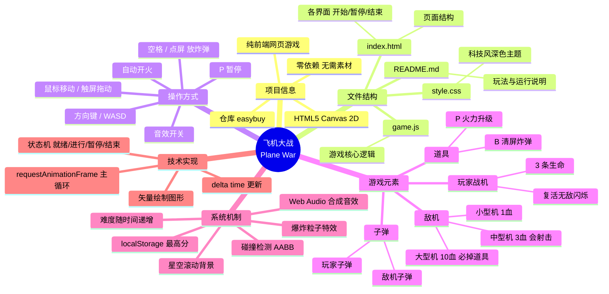

# 飞机大战 · 项目思维导图

> 用 Mermaid `mindmap` 描述，GitHub 可直接渲染为图形。

```mermaid
mindmap
  root((飞机大战<br/>Plane War))
    项目信息
      纯前端网页游戏
      零依赖 无需素材
      HTML5 Canvas 2D
      仓库 easybuy
    文件结构
      index.html
        页面结构
        各界面 开始/暂停/结束
      style.css
        科技风深色主题
      game.js
        游戏核心逻辑
      README.md
        玩法与运行说明
    操作方式
      鼠标移动 / 触屏拖动
      方向键 / WASD
      自动开火
      空格 / 点屏 放炸弹
      P 暂停
      音效开关
    游戏元素
      玩家战机
        3 条生命
        复活无敌闪烁
      敌机
        小型机 1血
        中型机 3血 会射击
        大型机 10血 必掉道具
      子弹
        玩家子弹
        敌机子弹
      道具
        P 火力升级
        B 清屏炸弹
    系统机制
      碰撞检测 AABB
      难度随时间递增
      爆炸粒子特效
      星空滚动背景
      Web Audio 合成音效
      localStorage 最高分
    技术实现
      requestAnimationFrame 主循环
      delta time 更新
      矢量绘制图形
      状态机 就绪/进行/暂停/结束
```
